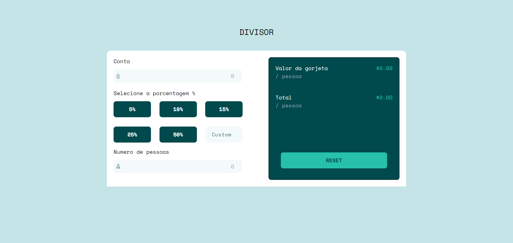
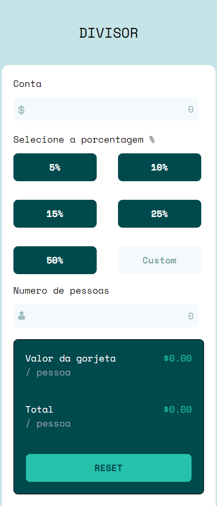

# 🏆 Calculadora de Gorjetas

Este projeto é uma calculadora de gorjetas interativa desenvolvida com **Angular 18 (standalone)** e **Tailwind CSS**. O usuário pode inserir o valor da conta, escolher a porcentagem da gorjeta e dividir entre o número de pessoas, obtendo o valor exato por pessoa.

---

## 🚀 Tecnologias Utilizadas

- ✅ **Angular 18** (standalone)
- ✅ **Tailwind CSS** (para estilização)
- ✅ **TypeScript**

---

## 📸 Captura de Tela

### Desktop

### Mobile

---